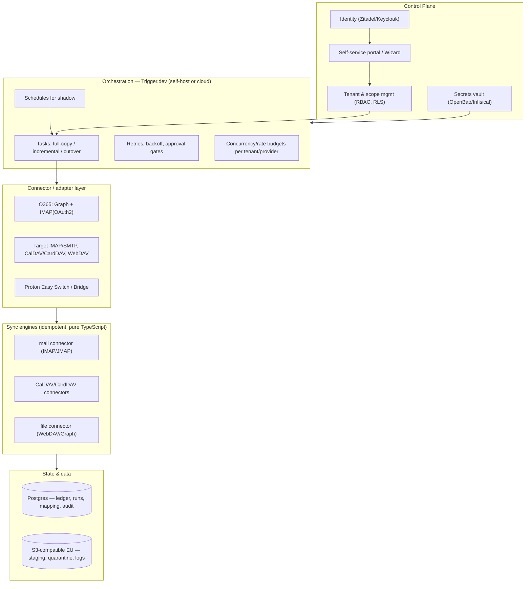
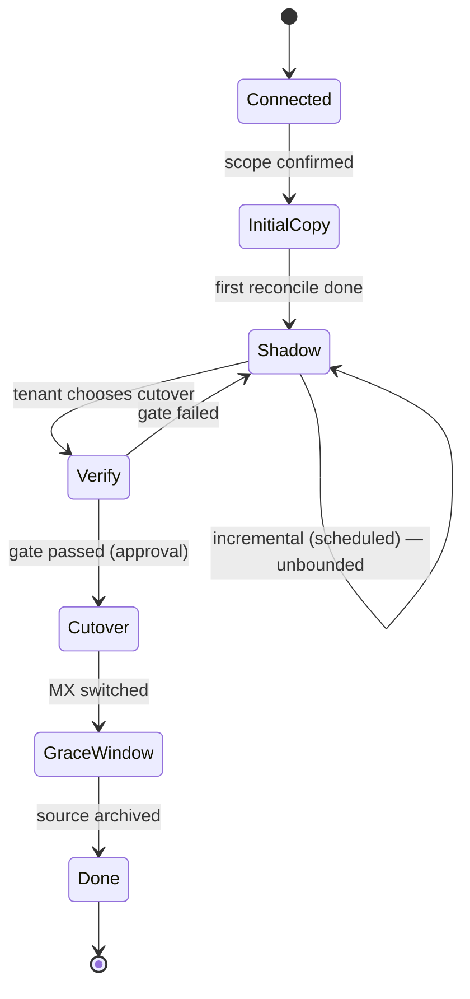

# Solution Architecture — Sovereign Migration Stack

**Version:** 1.5 (2026-08-03) — canonical copy, lives in `docs/architecture/`.
**v1.5 change:** §11's mode B (bidirectional) and §20's reverse sync are RETRACTED with dated notes (owner decision 2026-08-03, 0026 T3 rows 7–8) — one-way mirror is the only sync mode, and the source itself is the post-cutover fallback. §3 decision 3 and the §6 functional line carry the same note.

**v1.4 change:** §11.2 #4 carries the notification scope decided 2026-08-02 and built in workplan 0030 — email only, no in-app centre, with the empty-digest and blind-spot rules stated; §23's bilingual-notifications transfer is marked discharged there.

**v1.3 change:** the 0026 sweep's truth pass. §23 + the Languages header say the bilingual UI is BUILT (0024); §11.2 #1's drift-queue tail points at workplan 0028 (kept scoped, owner decision 2026-08-02); §13.1's rich extractor and §15.1's Proton half carry their retraction notes (same decisions); §14.1/§14.2 unchanged in substance — their builds are workplans 0027/0029.
**v1.2 change:** the tables caught up with the 2026-07-30 engine change — every imapsync/vdirsyncer/rclone reference in §7.3/§8/§9/§10/§11/§12/§13/§14/§21 now names our own TypeScript connectors (the §6 banner had acknowledged the change; the tables had not followed). §3/§18's "no self-hosted mail" corrected to ADR-0011's actual position (permitted, user-operated). §11.1's apply paragraph corrected: the IMAP/DAV mail target DOES implement `TargetRemover` (ADR-0024's correction). PGlite named as the appliance's embedded persistence option (§7.3/§22.1, ADR-0028). §23's bilingual claim marked as an unbuilt promise pending the workplan 0021 T5 owner decision. §24's ADR index extended through 0028; §25's Windows-packaging row updated per ADR-0027.
**v1.1 change:** added release management, versioning & data-migration controls (§22.1) and the migration-tooling decision (ADR-0017); clarified self-hosted targets are user-operated (ADR-0011); ledger schema v1 (`packages/ledger`, ADR-0016).
**Languages:** English is the development language (code, docs, ADRs). The end-user UI is bilingual **English + Dutch** (ADR-0013, built by workplan 0024) — see §23.
**Subject:** A low-maintenance stack that lets families and small/medium businesses migrate, at their own pace, off US cloud (Microsoft 365 / Google / Dropbox) to **managed EU/CH platforms** for email, calendar, contacts, files and related features.
**First migration path:** Microsoft 365 (O365) → Soverin / Nextcloud (Proton later).

---

## 1. Purpose & context
Many households and small organisations are locked into O365 (or Google/Dropbox) but want to move to European, standards-based alternatives for sovereignty and privacy. The hard part is not the destination but the *transition*: fear of data loss, no time for a big-bang cutover, and no IT department.

The stack solves this with three core properties plus one ambition:
- **Idempotent transfer** — a migration may be re-run any number of times without duplicates or corruption; re-running always converges to the same end state.
- **Shadow-running** — the sovereign environment runs in parallel with O365 for as long as the user wants, kept incrementally up to date; the user chooses the cutover moment.
- **Low-maintenance, EU-managed** — built on proven open-source sync engines, deployed on managed EU IaaS/PaaS/SaaS, with IaC/GitOps so operations are minimal.
- **A lasting interop layer (ambition)** — the same adapters that migrate later serve as a gateway so users can use sovereign services in any app and are never locked to one vendor again.

## 2. Goals & non-goals
**Goals**
- Self-service migration per tenant, no central IT required.
- Full-fidelity transfer of email (folders/Sent/Drafts/Archive, flags, attachments), calendar, contacts and files.
- Cheap continuous incremental sync during the shadow period.
- Two delivery editions from one core: self-host (hobbyist) and a managed service.
- GDPR-compliant processing with EU/CH data residency.

**Non-goals (for now)**
- Not full Exchange/SharePoint feature parity (workflows, Teams history, OneNote, retention holds).
- No migration of Teams chat/calls or Planner in v0.
- No *reliable bidirectional email sync in steady state* (a targeted asymmetric path exists — §11).
- **We do not host email ourselves.** Recommended targets are managed EU/CH platforms. Self-hosted targets (incl. self-hosted email, e.g. Stalwart/Mailcow) are *permitted* — they are standard endpoints — but **operated by the user; we take no responsibility for their hosting/deliverability/uptime** (§9, ADR-0011). (The self-host *edition of the migration tool* is a separate thing — see §7.)
- **Post-migration identity/login in the target suite is out of scope.** How users authenticate to Soverin/Nextcloud/Proton afterwards is the target platform's and the user's choice; we only handle the credentials/app-passwords needed for migration.

## 3. Confirmed decisions
1. **Two editions, one core.** A self-host edition (NAS/Pi/Spark, optionally single-user) and a managed multi-tenant service. Only the control plane differs; the migration core and idempotency are identical (§7).
2. **Recommended targets are managed EU/CH cloud platforms, in clusters.** Soverin/Nextcloud (default) and Proton (optional, family/individual). Self-hosted targets — including self-hosted mail — are *permitted* but user-operated; we migrate into them, we don't host them (§2 non-goals, §9). [ADR-0011]
3. **Shadow = one-way mirror + clean cutover**, with one asymmetric exception (send from the new environment while inbound still lands on O365 — a DNS/procedure choice, not a sync direction). ~~and bidirectional allowed for calendar/contacts/files~~ — **bidirectional retracted 2026-08-03** (owner decision, 0026 T3 row 7; see §11).
4. **Residency = EU + Switzerland.** US providers (and CLOUD Act exposure) excluded.
5. **Scale = small (family to SMB).** ~25 mailboxes per tenant, a few shared mailboxes (§21).
6. **Permissions: covered, not necessarily automated** — inventory + guidance, auto-apply only where mapping is clean (§14.2).
7. **Source extraction prefers Graph** (+ IMAP+OAuth2 for mail); EWS/DavMail avoided because Microsoft is retiring EWS in 2026 (§13). [ADR-0012]
8. **Language:** English for code/docs; end-user UI in English + Dutch — a promise not yet built (§23). [ADR-0013]
9. **License Apache-2.0; orchestration Trigger.dev (managed) + in-process scheduler (self-host); TypeScript** (§24).

## 4. Actors
- **Tenant admin** — head of household or business owner; connects sources/targets, sets scope, starts migration, chooses cutover.
- **End user** — owns one or more mailboxes/accounts.
- **Operator** — runs the managed service (you), with minimal manual effort.
- **Self-host admin** — runs the self-host edition on their own hardware.
- **Support** — read access to status/logs, no access to content.

## 5. Requirements
**Functional:** connect source via OAuth (O365) and targets via credentials/OAuth; choose scope (mailboxes, folders, calendars, address books, drives, date range); choose mode (one-time / one-way mirror; **bidirectional retracted 2026-08-03**, see §11); set schedule (continuous shadow vs one-shot); track progress/errors and per-item status; reconciliation report; cutover wizard with verification gate and DNS/MX guidance; (managed) self-service onboarding, billing, tenant isolation.

**Non-functional:** idempotency & resumability as the correctness guarantee (crucial for intermittent self-host hosts); low-maintenance (managed-first + IaC/GitOps + auto-updates); scalable (thousands of tenants in cheap delta shadow); secure & GDPR-compliant (EU/CH residency, data minimisation, encryption, audit log, right to erasure); throttle-tolerant (respects O365 Graph/IMAP and target limits); accessible bilingual UI (§23).

## 6. Architecture principles

> **Update 2026-07-30 — "reuse engines" did not survive contact with the build.**
> This document once named **imapsync**, **vdirsyncer** and **rclone** throughout
> as the transfer engines. They are not used. Wrappers for all three were
> written, exported from `@openmig/engines`, and imported by nothing; the real
> path is `runShadowPass` → `runDomainSync` over the connectors and target
> writers, in **pure TypeScript for all four domains**, and the wrappers were
> deleted on 2026-07-30 (see ADR-0019's update note). Nothing about the
> *protocols* changed, so the architecture is intact; the named binaries are
> historical, and the v1.2 revision swept the last references out of the tables
> below — they survive only in this note. The practical consequence is the
> point: **no Perl, no Python, no external binaries**, and since ADR-0028 even
> the last native dependency (Postgres) is optional in the self-host edition.

1. **Normalise to standards.** Adapters turn each source/target into a standard protocol (IMAP, JMAP, CalDAV, CardDAV, WebDAV); our own TypeScript connectors do the inherently idempotent transfer (the original "reuse engines" half of this principle did not survive — see the update note above).
2. **Idempotency lives in the engines + a ledger**, not the orchestrator — so the orchestrator is swappable and the self-host edition can use a much lighter scheduler.
3. **Non-destructive by default.** A one-way mirror never touches the source; rollback before cutover is simply keeping O365.
4. **One core, two control planes.** Engine and ledger layers are identical; only the control plane differs per edition.
5. **Managed-first + IaC-always** (managed service); **local-first + dependency-light** (self-host).
6. **Honest about limits.** Where a target lacks an open protocol (Proton calendar/contacts), we claim no live sync but offer the best achievable (snapshots).

## 7. Delivery model: two editions from one core
The same codebase yields (a) a **self-host edition** someone runs on their own hardware (NAS/Pi/Spark), optionally single-user, and (b) a **managed multi-tenant service** you host for people without a server. Only the control plane differs.

### 7.1 Self-host edition (the hobbyist)
One all-in-one bundle in several packagings: **Docker Compose** (NAS/mini-PC/Pi/laptop), a **Home Assistant add-on** (Supervisor-managed), and an optional **hybrid agent** registered to the managed control plane that executes locally so the operator never sees content. Because everything is idempotent + delta, an intermittently-on host resumes cleanly. No heavy orchestrator runs here. (This is about *where the tool runs*; it is **not** self-hosted email — targets remain managed EU/CH platforms.)

### 7.2 Managed edition (operated by you, low effort)
Multi-tenant (`tenant_id` + Postgres RLS, per-tenant workspaces/rate budgets), cost-recovery billing (§16), tenant isolation, SSO/IdP, autoscaling workers, managed Postgres/object storage, low-ops via GitOps + auto-updates.

### 7.3 What is shared and what differs
| Layer | Shared (identical) | Self-host | Managed |
|---|---|---|---|
| Engines | TypeScript connectors (IMAP/JMAP/CalDAV/CardDAV/WebDAV) + Graph extractor | idem | idem |
| Adapters/connectors | O365/IMAP/WebDAV/CalDAV/CardDAV/Proton | idem | idem |
| Migration core | reconcile + idempotency + ledger schema | idem | idem |
| UI | scope manifest, status, decision queue (§11.2) | idem (single-user) | idem (per tenant) |
| **Orchestration** | interface `Scheduler/JobRunner` | **in-process** (croner) | **Trigger.dev** (self-host or cloud) |
| **State** | ledger contract | **bundled Postgres (compose) or embedded PGlite** (`SELFHOST_PERSISTENCE=pglite` — no container, no port; ADR-0028) | **managed Postgres + RLS** |
| **Tenancy** | — | single | multi-tenant (RLS) |
| **Secrets** | — | OS keychain / age-encrypted file | vault (OpenBao/Infisical) |
| **Auth** | — | local / single-user | IdP/SSO (Zitadel) |
| **Provisioning** | *retracted (ADR-0008, 2026-08-02)* — owner supplies existing-account credentials; guidance in docs | idem | idem |
| **Billing** | — | none | cost-recovery (Mollie) |

Core rule: **orchestration, state, tenancy, secrets, auth, provisioning and billing are the only axes that differ per edition; everything above (core + UI) is one codebase.**

## 8. Logical architecture (managed; self-host is the slimmed variant)

In the **self-host edition** the heavy orchestration layer is replaced by an in-process scheduler, the ledger is embedded, and there is a single tenant.

## 9. Targets: choosing an EU/CH destination
Underlying capability matrix:

| Domain | O365 source (read) | Soverin | Nextcloud | Proton |
|---|---|---|---|---|
| **Email** | IMAP + OAuth2 (XOAUTH2) or Graph | IMAP/SMTP | no mail host (client only) | Easy Switch import; continuous only via Bridge (paid, heavy) |
| **Calendar** | **Graph** | CalDAV | CalDAV | Easy Switch import; no CalDAV |
| **Contacts** | **Graph** | CardDAV | CardDAV | Easy Switch import; no CardDAV |
| **Files** | OneDrive/SharePoint via Graph | n/a | WebDAV | official SDK + CLI since 2026, but no WebDAV and no headless auth — see §9.4 |
| **Office** | n/a | n/a | Collabora/OnlyOffice | Proton Docs (limited) |

Three choice clusters (recommended targets are managed EU/CH; **self-hosted targets, incl. self-hosted email, are permitted but user-operated** — we migrate into them, we don't host them, ADR-0011):

### 9.1 Cluster A — "Maximum privacy, one provider" (Proton) — *optional; mainly family/individual*
Replaces Gmail+Calendar+Drive+Docs+1Password with one Swiss E2E-encrypted suite. Strong on encryption/simplicity; weak on open-protocol interop (mail only via Bridge; calendar/contacts only via ICS/vCard snapshots), continuous shadow, Drive migration, and **no shared mailboxes/delegation** -> poor SMB fit (§9.4). Migration via Easy Switch + forwarding.

### 9.2 Cluster B — "Open standards & app freedom" (Soverin + Nextcloud) — *recommended default*
Replaces Gmail/Outlook with Soverin (mail/calendar/contacts, NL, own domain) and Drive/Dropbox/OneDrive+Docs+Photos with Nextcloud (WebDAV, Collabora/OnlyOffice, Photos, Talk). Works with any client (IMAP/CalDAV/CardDAV/WebDAV), no lock-in, full idempotent + shadow sync. Soverin also offers native shared/team calendars, e-mail groups, catch-all/forwarding (SRS/ARC), app passwords and OpenPGP. Migration via our own IMAP/DAV/WebDAV connectors.

### 9.3 EU/CH alternatives within cluster B, and sovereign public-sector suites
Mail alternatives: Mailfence (BE, CalDAV + EU), Mailbox.org (DE, Open-Xchange-based), Posteo (DE), Infomaniak kSuite (CH). Nextcloud may be a managed EU Nextcloud or one the user already runs.

**Open-Xchange (OX App Suite)** deserves special mention: OX serves mail/calendar/contacts over **IMAP/SMTP, CalDAV and CardDAV**, so any OX-based service is a first-class target via our existing engines (many EU hosts offer OX, e.g. Mailbox.org).

**Sovereign public-sector suites.** Because the stack is target-agnostic — any standards endpoint (ADR-0011) — government "sovereign workplace" suites are supportable to the extent they expose open protocols:
- **openDesk** (Germany, ZenDiS) bundles **Open-Xchange** (mail/cal/contacts over IMAP/CalDAV/CardDAV) + **Nextcloud** (files over WebDAV) + Collabora/Element/Jitsi/OpenProject/XWiki. Its mail/cal/contacts/files map exactly onto cluster B, so **openDesk is a supportable target with no new connectors**, and it ships as a self-hostable community edition *and* a managed SaaS — viable for SMBs and self-hosters. Proof point: Schleswig-Holstein migrated 40,000+ accounts and 100M+ mail/calendar items off Microsoft Exchange to Open-Xchange in late 2025.
- **La Suite numérique** (France, DINUM) and its **SaaS resellers** are a different case from openDesk. The gov-hosted instance is public-sector-only, but the open-source bricks are resold as **managed SaaS** by third parties — notably **mosa.cloud** (and the Dutch **MijnBureau** is the same family) — so *availability is not the blocker*. The blocker is **protocol**: the La Suite mail brick (**Messages**) **deliberately ships no IMAP** ("no POP3 or IMAP, by design"; JMAP-inspired data model), and the stack is **JMAP-first**, with calendar/contacts/files following the same modern-protocol path rather than CalDAV/CardDAV/WebDAV. So this family is reached via the **JMAP adapter**, which is now the stack's **primary target path** (§13.2, ADR-0018) — not via the IMAP/DAV family. The bespoke apps (Docs, Grist, Meet, Chat) stay out of scope.

The bespoke collaboration apps in these suites (Matrix chat, no-code databases, video, collaborative editors) are out of scope — exactly as Teams/Planner are (§11.2).

### 9.4 Proton positioning
Proton's E2E/zero-access encryption is exactly what blocks openness — no CalDAV/CardDAV, mail only via Bridge, and no Exchange-style shared mailboxes/delegation (only aliases to individual accounts). Keep Proton as an **optional** family/individual destination via one-time Easy Switch import + forwarding (deferred past MVP), never as a continuous-shadow target; Bridge interop only in the self-host/local edition. Default remains cluster B.

**Proton Drive as a files target — reassessed 2026-07-30.** The 2025 line "weak/no sync API" is out of date, but the conclusion has not changed, and the reason has moved. Proton now ships an official **Drive SDK** (`github.com/ProtonDriveApps/sdk`, MIT, with a TypeScript client) and an official **Drive CLI** (released 9 June 2026, Windows/macOS/Linux, `--json` output). The SDK's surface — folder listing, upload, download, move, rename, trash, event-based change polling — maps cleanly onto our `FileTargetWriter` + `TargetReindexer` + `TargetRemover` ports, with trash giving an honest `binned` removal kind. So the *file operations* are no longer the problem. Four things still are, in order of severity:

1. **There is still no WebDAV**, so this cannot be a `webdav` target with a different URL. It is a new connector, not a configuration. (WebDAV remains one of the most-requested Proton Drive features and is not on the published roadmap.)
2. **Authentication is browser-interactive and has no headless path.** The official CLI signs in via a browser and caches the session in the OS secret store; there are no app passwords, no API keys and no long-lived tokens — nothing equivalent to the IMAP app passwords every other target here accepts. This product is a **headless worker on a schedule**, so this is not an inconvenience, it is a contradiction. A session that must be re-established interactively cannot back an unattended continuous shadow sync.
3. **The SDK is pre-GA.** Proton states it is "not yet ready for third-party production use" with interface changes expected until general availability, targeted **end of 2026 / early 2027**. It also deliberately excludes login and session management — precisely the part that blocks us — leaving that to other Proton libraries.
4. **E2E encryption means key custody.** Every other target here receives bytes over TLS and encrypts server-side; Proton requires the client to encrypt with the user's own keys, so the worker would have to hold that key material. Defensible in the **self-host** edition, where it never leaves the owner's hardware — the same reasoning that already confines Bridge there — and not defensible in the **managed** edition. §20 verification is affected too: with no server-side content hash to compare against, checksum sampling would mean download-and-decrypt.

**Position ([ADR-0025](../adr/0025-proton-drive-target-deferred.md); plan in [workplan 0014](../workplans/0014-proton-drive-target.md)):** revisit when the SDK reaches GA *and* Proton offers a non-interactive credential. Until the second of those exists, a Proton Drive target could be written but could not be run the way this product runs. If it is built before then, it belongs in the self-host edition only, and honestly labelled as operator-attended rather than scheduled. The reverse-engineered route (rclone's `protondrive` backend over `henrybear327/Proton-API-Bridge`) is explicitly **not** the answer for a migration tool: it is Beta, built by observing browser traffic because Proton publishes no API docs, self-declares incompatibility with some accounts, and hard rule 1 does not survive a target that might silently behave differently per account.

## 10. Data domains & idempotency
| Domain | Natural key | Change detection | Engine |
|---|---|---|---|
| Email | `Message-ID` (fallback: hash of normalised headers+body) | hash + size | mail connector (IMAP/JMAP) |
| Calendar/Tasks | iCal `UID` (+ `RECURRENCE-ID`) | ETag/hash | CalDAV connector |
| Contacts | vCard `UID` | ETag/hash | CardDAV connector |
| Files | normalised path | size + mtime + checksum | file connector (WebDAV/Graph, checksum) |

**Reconcile loop:** enumerate source delta -> compute natural key + content hash -> look up ledger -> decide create/update/skip/delete -> apply -> upsert ledger. Re-running with no source change => all "skip" => no side effects => **idempotent**. Cheap deltas: Graph delta queries; IMAP `CONDSTORE`/`QRESYNC`; CalDAV/CardDAV `sync-collection` (RFC 6578); file-connector checksum/modtime diff.

### 10.1 Folders, Sent items and special-use folders
- **Full folder tree by default.** The mail sync copies all folders, so Inbox, **Sent**, Drafts, Archive and subfolders all migrate (Trash/Junk are excluded by default — see §11.1's `excludeSpecialUse`).
- **Special-use mapping (RFC 6154):** "Sent Items" (O365) is mapped to the target Sent (`\Sent`), and likewise `\Drafts`/`\Junk`/`\Trash`/`\Archive`, so the client recognises them correctly.
- **Sent is continuously synced during shadow** (idempotent on Message-ID), not just on the initial copy.
- **With asymmetric sending (§11):** the target accumulates its own new sends while O365-Sent is synced in one-way, so at cutover the target holds the complete Sent history; Message-ID keys de-duplicate.

### 10.2 Data-fidelity edge cases (scoped for families/SMB)
Cover the common 95% automatically; inventory + guide the rare bits.
- **Encrypted/signed mail (S/MIME, PGP):** migrated as opaque MIME (preserved, not decrypted).
- **Flags/categories/importance:** preserved where standard IMAP supports them.
- **Signatures, out-of-office, server-side rules/filters:** not messages -> surfaced as guided manual steps (§14.2).
- **Online/archive mailbox:** treated as an additional mailbox to migrate.
- **Recurring-event exceptions & time zones:** handled via iCal UID + RECURRENCE-ID.
- **Target message-size limits:** oversize items detected and flagged rather than silently dropped.

## 11. Shadow-running & cutover
**Modes:** A — one-way mirror (default; user keeps using O365, sovereign stays warm/validated). ~~B — bidirectional for calendar/contacts/files only (the DAV/file connectors; conflict policy: hash-equality -> last-writer-wins by mtime -> keep-both + flag).~~ **Update 2026-08-03 (owner decision, 0026 T3 row 7): MODE B IS RETRACTED.** Mode B was an enum value nothing branched on — the 2026-08-02 sweep found no code reading the mode at all. It is withdrawn rather than built, for a reason bigger than effort: writing changes back to the SOURCE means this tool modifies the system the customer is leaving, which is the one place hard rule 2 promises never to touch. It also needs conflict resolution, loop suppression (our own write must not read back as a user change) and a per-item causality record the ledger does not carry — that is a different product, not a larger version of this one. **One-way mirror is the only sync mode.** Changes made on the TARGET during shadow are surfaced as decisions in the queues (§11.1/§11.2), never copied back. **Asymmetric path** ("send from new, receive on old"): MX stays on O365 (inbound mirrored), but you already send from the sovereign environment — either send-as the existing address (needs SPF/DKIM for both providers; DMARC `p=none` during transition) or from the new address. Mail stays one-way until cutover.

**Email cutover:** final delta -> optional source read-only/forwarding -> switch MX/DNS + autodiscover -> reconfigure clients -> grace window with reverse read -> archive. A **verification gate** (counts/checksums within tolerance) is an approval step before the DNS switch.

### 11.1 Discovery & drift: the old system changes during shadow
A scheduled **discovery process** detects source/target changes and sorts each into: **automatic** (safe/additive: new mail/events/files, flag changes, new alias), **owner decision** (topology/cost/destructive/identity/ambiguous: new mailbox, deletion, quota, shared-address pattern, offboarding), or **alert** (errors: auth failure, over-quota, stalls). Core principle: **the source is authoritative for content; the owner is authoritative for topology/lifecycle decisions; deletions are never auto-propagated.** Enablers: stable identity via the immutable Graph GUID (renames are updates, not delete+create), and policy presets per category (cautious owners review each; experienced owners auto-approve categories). A useful side effect: because deletions are not mirrored, the new environment often becomes a *fuller* archive than the shrinking source.

**Implemented — the owner's discarded mail is out of scope by default.** Nothing filtered on RFC 6154 special-use, so a migration copied Deleted Items and Junk into the new mailbox alongside everything the owner had kept — not as a decision, but as what iterating the folder list did. `MappingConfig.excludeSpecialUse` now defaults to `['trash', 'junk']`, the pass reports which roles it skipped, and discovery counts what is in them (`excludedItems`, plus a per-collection `excluded` reason) so the §11.2 confirm screen states the choice instead of a default being silently applied. Set it to `[]` to migrate everything, which is legitimate for anyone treating Deleted Items as an archive. This is also the first step of the deletion design: an item in Deleted Items is *explicit* evidence the owner deleted it, which is far stronger than the absence-counting the deletions queue must otherwise rely on — taking the trash out of scope as content is what makes it available as a signal. Mail only; calendars and address books have no trash in their collection listing, and a Nextcloud file trashbin lives at its own endpoint.

**Implemented — the owner works in the target during shadow.** Shadow migration invites the owner into the new system before cutover, which puts the "source is authoritative for content" rule on a collision course with hard rule 2 the moment they edit something we copied. Ownership was being judged from the ledger's status: `copied` records that we wrote the bytes once, not that they are still ours, so a later source change silently replaced the owner's edit and counted it a success. Every row now also records the **target's** own version marker (the ETag the server returned for our write), and a rewrite is refused unless the target still reports it. Refused items are marked `adopted` — the bytes are the owner's — reported as `conflicted`, and never candidates for overwrite again; each later source change to them surfaces as `changedButAdopted`. Two limits stated plainly: rows written before this, and servers that return no ETag on PUT, carry no recorded version and keep the old overwrite behaviour; and a refused item stops receiving source updates permanently, because merging two edits is not something this tool can do. Target-side **deletions** are deliberately not repaired — restoring what someone deleted on purpose is its own kind of destructive — but they are reported as `missingOnTarget` and hold the §20 gate closed.

**Implemented — deletions the source states outright.** Both DAV connectors poll with an RFC 6578 `sync-collection` REPORT, whose answer contains the objects that CHANGED *and* the ones that were REMOVED — each as a `<response>` carrying an href and a 404 status. Both parsers dropped the second half on the floor, so the strongest deletion signal the product has access to arrived on every incremental pass and was discarded, leaving the deletions queue to infer everything from repeated absence. It is now read, and carried through as evidence of a different **kind**: `ItemDeletion.evidence` is `reported` (the source said so — confirmed on sight, since a second pass cannot make a server's own 404 truer) or `inferred` (we stopped seeing it — still `DELETION_CONFIRMATIONS` consecutive complete scans before anyone is told). Only `reported` will ever be eligible to gate a destructive action; deleting a customer's data because a listing was throttled is the worst thing this product could do. Three details are load-bearing. A 404 under `<response>` means the resource is gone, while a 404 inside `<propstat>` means a property has no value — servers send the second routinely, and confusing them would report live objects as deleted. A removed object has no body, so no UID, so no natural key: the match runs through the source href recorded on the ledger row at copy time, which is what `item.source_ref_href` (migration 0025) exists for. And removals are resolved only after every folder has been listed, because a UID moved between two collections is reported as a removal from one and an arrival in the other — resolving per folder would report a move as a deletion. Unlike absence-based detection this is deliberately *not* gated on a complete key set: the server named the object, so an incremental listing cannot make that untrue. Mail has no equivalent report and stays on the absence path; an item that returns clears the report along with the count, because a UID can be deleted and re-created.

**Implemented — the owner's bin, read as a deletion signal.** The mail domain had no deletion signal whatsoever: IMAP offers no removal report of the kind `sync-collection` gives, and a mailbox cannot be enumerated cheaply enough to run absence-counting on every pass — so a message the owner deleted in the old system produced *nothing*, and the target kept its copy in silence. What mail does have is a folder whose RFC 6154 role is `\Trash`, and an item in it is the source system's own record that the person deleted it. That is a **positive observation** — we are looking at the item rather than failing to find it — so it is believed on sight, like a removal report and unlike an absence. `ItemDeletion.evidence` therefore has a third value, `trashed`, ranked below `reported` ("gone entirely" supersedes "in the bin") and above `inferred`, each with its own date so a later stronger signal never overwrites when an earlier one was learned. This is what the trash exclusion above was the first step of: what the migration no longer copies as content, it can read as a signal — and reading it both ways is refused, so an owner who sets `excludeSpecialUse: []` gets their bin migrated and no longer interpreted. **Junk is deliberately not read this way**: a message there was very likely classified by a filter rather than deleted by a person, and this signal's entire value is unambiguous owner intent. Two mechanics are load-bearing. The scan keeps its **own cursor namespace** (`discardedScanCursorKey`), because sharing the folder's content cursor would mean an owner who later brought the bin into scope found it already advanced past every message in it — never copied, no ledger row to show it, a silent partial migration produced by a bookkeeping collision. And the one residual false positive is stated rather than hidden: the same Message-ID genuinely lives in two folders on many servers, so a message in both the bin and a live folder is reported when the live copy was not listed that pass, and the claim is cleared by the next pass that lists it. Requiring a complete mailbox listing instead would fire the signal on the first pass and never again. **Implemented — the file domain's two better signals.** Files had only absence-counting, the weakest of the three, while both file sources could say more and neither was asked to. **OneDrive/SharePoint** answer a delta query with the items that changed *and* the ones deleted, each carrying a `deleted` facet — the Graph equivalent of a `sync-collection` 404, and it was being read and discarded under a comment saying deletions "should be handled separately" with nothing handling them. Those are now `reported`, matched back through the item **id**: a deleted delta entry carries no reliable path but always its id, which is why the file domain records the source's own handle as `source_ref_href` rather than re-recording the path it already keys on. **Nextcloud** keeps a trashbin at its own endpoint whose entries carry `{http://nextcloud.org/ns}trashbin-original-location`, giving files the same `trashed` evidence mail has. A bin is not a WebDAV concept at all — RFC 4918 has none — so the endpoint is derived from the files URL and probed, and a server that does not serve one reports nothing and stays on absence-counting; a 404/405/501 is "no bin", while any other status is an error rather than a silent empty answer. The single thing that makes or breaks it is that the paths agree exactly with `FileItem.path`, because a path differing by a leading slash, a percent-escape or a `rootPath` prefix hashes to something no row holds and the result is not an error but **silence** — the failure this repo has already shipped four times. Hence one normalisation function with its own tests (`trashbinPathToKeyPath`), hashing through the same `fileNaturalKeyHash` on both sides, and an e2e fixture that deletes real files (including one with a space and a non-ASCII character) and *asserts* the returned form rather than merely seeding. Two consequences stated plainly: a deleted folder is one trashbin entry, so the files under it are reported one step slower as `inferred`; and because a deleted file is both in the bin and missing from the listing, the two detectors fire on the same pass and the pass result collapses them to one entry per item, keeping the strongest evidence and the highest absence count.

**Implemented — `apply`, the one destructive operation in the product.** Every deletion mechanism above only ever reports; the target keeps its copy until an operator explicitly says otherwise. `apply` (`POST /mappings/{id}/deletions/{hash}/apply`, `applyDeletion` in `@openmig/core`) is that explicit decision, made one item at a time, and it is the first thing this codebase has built that removes a customer's data on purpose. Hard rule 2 forbids the tool deleting *of its own accord*; it does not forbid an owner deciding about their own data, which §11.2 reserves to them — so the whole design effort here is keeping that line bright: nothing is automatic, batched, or inferred. Seven gates sit in front of every call: (1) off unless the mapping sets `allowApplyDeletions: true`; (2) the target must implement `TargetRemover` — a writer that does not refuses explicitly rather than silently no-opping; (3) **only positive evidence** (`reported`/`trashed`) may be acted on, never `inferred`, however many passes an absence has repeated; (4) only an item this tool wrote (`copied`/`updated`) — an `adopted` item was the customer's before the migration existed; (5) the target's ETag is re-checked at the moment of removal, refusing if the owner has since edited it there; (6) a **mass-deletion circuit breaker** refuses every call for a domain once more than a fifth of its migrated items (with at least 20 in the corpus) are sitting in the deletions queue at once — the reasoning being that such a spike is far likelier to be a source outage or a misconfigured connector than genuine bulk owner intent, and once the evidence looks that wrong in bulk no single item in the queue is trustworthy either; (7) the ledger's own conditional UPDATE re-checks evidence and ownership in SQL, so two concurrent applies cannot both succeed. The write order is REMOVE FIRST, RECORD SECOND: a failure between the two leaves the row still claiming the item is on the target, which §20 verification reports as `missingOnTarget` — loud and correctable — rather than the reverse (a row claiming an item gone while the copy silently remains, which nothing would ever notice). A removed row is never deleted; it is marked `status: 'tombstoned'` (a value the schema has allowed since migration 0001 and never used until now) with `deletion_applied_at` recorded, so the row survives as the audit trail. `isOnTarget` treats `tombstoned` as NOT on the target, on purpose — it is the one status this product creates by destroying something. What "removed" means is reported back as `binned` (the target's own recoverable bin — Nextcloud's trashbin, or a JMAP account's `\Trash`-role mailbox when it has one) or `deleted` (no recovery path this tool knows of); calendar and contact removals always claim `deleted` rather than guess at a Nextcloud version's retention behaviour, which is the safe direction to be wrong in. The one correctness property that had to be added by hand rather than falling out of the existing loop: `classifyKnownItem` now returns a `'tombstoned'` action ahead of every version rule, and the sync loop leaves such a row untouched and counts the reappearance (`reappearedAfterRemoval`) rather than re-creating the item — because if the source still lists a key whose target copy was explicitly removed, this code has no way to distinguish "the owner changed their mind" from "this was an erasure request and restoring it is a compliance failure", and silently re-copying it would undo a destructive decision an operator made on purpose. Implemented for the CalDAV, CardDAV, WebDAV, JMAP **and IMAP/DAV mail** writers (the mail target's `removeItem` reports `deleted` — IMAP knows no recoverable bin it can vouch for; an earlier revision of this paragraph claimed the mail target lacked `TargetRemover`, corrected by ADR-0024's update note and here in v1.2).

**Implemented — items relocated on the source.** Every ledger row now records the source collection it was copied from, and a pass reports (`moved`, with `from`/`to`) any item the source lists somewhere else. Nothing is written and nothing is deleted: the delete half of a move is forbidden by hard rule 2, and topology belongs to the owner. Detection differs by how the domain is keyed. Calendar, contacts and mail keep a stable natural key across a move, so it is a direct comparison. Files are keyed by *path*, so a move mints a new key — the old key's disappearance is correlated with an identical item appearing elsewhere. That needs the collection's **complete** key set, which a cursor-limited listing does not give (it returns what changed, so untouched and deleted look alike); the WebDAV source therefore answers a cheap `listKeys` from the PROPFIND it already issues, and detection runs on ordinary incremental passes. A source that cannot answer it cheaply gets detection only on a full scan. Two consequences worth stating plainly: the first pass after a file move still creates the copy at the new path (the disappearance is only knowable once every folder has been listed), so the target then holds both; and for mail an item in two folders is reported the same way as one that moved, because within a pass the two are indistinguishable. Acting on a move (a real MOVE on the target, behind an owner decision) is a later slice; today the operator gets the facts.

### 11.2 User control, transparency & UI
The user stays in control; nothing irreversible happens without it being visible and approved. Four UI principles:
1. **Scope manifest — what migrates, what doesn't, and why.** Explicit, readable, shown before start and always available — no silent omissions. *Migrates:* email (folders/Sent/Drafts/Archive), calendar, contacts, OneDrive/SharePoint files, shared mailboxes (pattern S) and distribution lists (pattern D). *Partial:* permissions (§14.2) — the Proton calendar/contacts row was removed 2026-08-02 with the §15.1 retraction, and SharePoint metadata/versions/lists moved to *does not migrate* the same day (§13.1 retraction). *Does not migrate (named explicitly):* SharePoint versions/permissions/metadata/lists/pages, Teams chat/calls, Planner, Power Automate, InfoPath, OneNote (unless set up separately), retention holds, other O365 apps with no sovereign equivalent. **Partially implemented (workplan 0013, both editions):** a pre-sync **Review & confirm** step shows live, read-only per-domain discovery counts (collections/items/bytes) alongside this manifest, and the mapping only starts syncing once the owner clicks **"Start migration"** — the managed web wizard (`ConfirmMigration`) and the self-host appliance's own confirm page (`GET /`) both implement this. The item-level decision queues (deletions/moves/failures) shipped with ADR-0026's operating screens; the mapping-level §11.1 drift decision queue is **workplan 0028** (owner decision 2026-08-02: kept, scoped to two categories).
2. **Status & progress.** Per mailbox/domain state (queued / initial copy / shadow / verified / cutover), overall progress, sync freshness, last run, errors — derived from the ledger and orchestrator.
3. **Decision queue ("actions required").** The §11.1 choices appear here with a safe default and one-tap choice; policy presets decide what lands here vs runs automatically.
4. **Asynchronous, come back anytime.** Migration/sync runs server-side; the user can close the app and return to see status or make choices. Notifications (in-app/email) on a required decision or milestone. **Update 2026-08-03 (owner decision 2026-08-02, workplan 0030 — scope narrowed and built):** **email only.** There is no in-app notification centre and none is planned; the bell icon this line once implied was cut deliberately, because the person who needs telling is the one who is NOT looking at the app. What is built: ad hoc emails on a mapping's runs failing repeatedly, a verification finishing, a migration finishing and a migration being rolled back (`notifyUsers` on the rollback job is real as of T4 — it was an honest refusal before that); and a **"what needs attention" digest** computed at send time from the same envelopes the screens read — pending drift decisions, the deletions/moves/failures queues, and mappings sitting in READY_FOR_CUTOVER. Two rules govern it: an empty digest is **not sent** (a weekly "all clear" trains its reader to filter the channel, taking the one that mattered with it), and a queue that could **not be read** always sends, naming the reason verbatim — "I found nothing" and "I could not look" must never arrive as the same email (hard rule 9). Cadence is per edition: the appliance takes `NOTIFY_DIGEST` from its own `.env` alongside the owner's own SMTP (rule 5 — nothing managed), managed stores it per tenant on the Tenants screen and one daily task asks each tenant whether today is their day. **0024's transferred requirement is discharged:** every template is EN/NL with compile-time key parity, and the prose boundary holds inside emails — a decision's summary, a run's `lastError` and an operator's rollback reason ride verbatim in both languages. `decision_raised` is wired to nothing yet, because nothing raises decisions until 0028's detectors exist.
**Control actions:** pause/resume, adjust scope, choose mode, approve decisions, start cutover (behind the verification gate).

## 12. Orchestration
**Managed:** **Trigger.dev** (Apache-2.0, TS-native; durable long-running tasks, retries, idempotency, tenant-scoped concurrency; self-host via Docker or cloud). Control plane sees only job metadata/status; because the connectors move data directly source->target, the orchestrator never sees message content. **Self-host:** in-process scheduler (croner/node-cron), no heavy orchestrator. Both sit behind a `Scheduler` interface, so the choice is swappable. Heavyweight alternative if ever needed: Temporal (MIT, heavier self-host). [ADR-0004]

## 13. Connectors & adapters
**Source — O365:** one multi-tenant Entra app; OAuth2. Mail via **IMAP + OAuth2 (XOAUTH2)** through our mail connector (primary), Graph fallback if IMAP is disabled per mailbox. Calendar/contacts via **Microsoft Graph** (delta queries). Files via **Graph** (OneDrive/SharePoint) through our file connector. **DavMail/EWS is avoided**: Microsoft is retiring EWS in 2026, so EWS-based gateways are a liability; Graph is the durable path. Least-privilege via Application Access Policy (§17). 

**Targets (two families).** *JMAP (primary):* JMAP-native servers/suites — Stalwart (reference), **mosa.cloud / La Suite / MijnBureau** — written via the JMAP adapter (§13.2). *IMAP/DAV (parallel second):* Soverin (IMAP/SMTP, CalDAV, CardDAV, NL); **openDesk** (Open-Xchange over IMAP/CalDAV/CardDAV + Nextcloud WebDAV); Nextcloud (WebDAV, CalDAV/CardDAV); Mailbox.org/Mailfence/Posteo/Infomaniak; Proton (Easy Switch import primary; Bridge only in the local edition). Both families ship in the MVP (ADR-0018).

### 13.1 Rich extraction of complex sources (OneDrive/SharePoint, PST, OneNote)
The file connector copies files/folders/timestamps (the bulk). A custom **Graph extractor** handles the layer a plain file copy skips: version history (`/versions`), permissions (`/permissions`), metadata/columns (`/listItem/fields`), SharePoint lists and site pages. Optional: **PnP** (MIT) for deep SharePoint structure, **libpst** for PST archives, Graph OneNote API for notebooks. **No commercial SharePoint tools** (Metalogix/ShareGate/AvePoint) — closed, costly, SharePoint->SharePoint oriented; wrong fit for an open EU stack with a Nextcloud destination. "Complete" = extract everything of value and land it sensibly (lists -> Nextcloud Tables, pages -> Collectives, versions -> optional replay or a timestamped `_versions/` folder); inventory + flag what cannot map. [ADR-0007] — *Rich extractor retracted for now (0026 T3 row 3, owner decision 2026-08-02)*: zero extractor code was ever built, the targets cannot cleanly receive most of the rich layer, and the scope manifest now lists SharePoint extras under *does not migrate* instead of promising "best-effort". Files/folders/timestamps — the bulk — migrate as before. The paragraph above stays as the design record for if SMB demand reopens it (ADR-0007 update note, same date).

### 13.2 JMAP — primary target protocol
**JMAP is the primary target protocol for this stack**; IMAP/CalDAV/CardDAV/WebDAV (DAV) is the parallel second family, and **both ship in the MVP** (ADR-0018). JMAP (RFC 8620/8621, plus the newer JMAP for Calendars/Contacts/Files) is the modern JSON-over-HTTP successor to IMAP/CalDAV/CardDAV/WebDAV, and it is what the French/Dutch sovereign stacks (La Suite **Messages**, **mosa.cloud**, **MijnBureau**) have chosen — they deliberately omit IMAP. **Asymmetry to keep in mind:** the **O365 source still uses IMAP+OAuth2/Graph** (Microsoft has no JMAP), so JMAP applies to the **target write-path** and the internal model, not source extraction. **Engine:** our own JMAP target writer — the same reconcile loop over the ledger serves both the initial bulk copy and **incremental shadow** (an earlier revision planned to reuse an external one-shot JMAP import utility for the bulk copy; the built path needs no external tool). **Stalwart** — which speaks *both* JMAP and IMAP/CalDAV/CardDAV/WebDAV — is the reference target for dev/e2e; **mosa.cloud** (JMAP) and **openDesk** (OX over IMAP/DAV) are the real targets. **Maturity:** JMAP **Mail** is well-implemented; JMAP for **Calendars/Contacts/Files** is newer (Stalwart since late 2025), so mail leads and cal/contacts/files follow. [ADR-0018]

## 14. First migration path — O365 → targets
- **Cluster B (Soverin + Nextcloud), recommended:** mail via IMAP+OAuth2; calendar/contacts via Graph -> CalDAV/CardDAV; files via Graph -> WebDAV — all through our own connectors; office in Collabora/OnlyOffice. Full shadow + clean cutover; optional asymmetric send first.
- **Cluster A (Proton):** Easy Switch import + forwarding + periodic top-up; no open-protocol continuous shadow (stated plainly in the wizard).

### 14.1 Shared addresses: two patterns, both in the sync
A shared address (info@, sales@) can work two ways; **both are first-class and both go into the migration/sync**, but migrate differently. The wizard asks per address:
> *Do recipients jointly handle one shared mailbox, or should it work as a distribution list (multiple recipients each receive the mail)?*
Source detection provides a default; the admin may override.
- **Pattern S — shared mailbox (jointly handled).** Source: O365 shared mailbox (or M365 group with a store). Target (Soverin): a **dedicated mailbox** with team access via **app passwords**; Send-As works. Sync: the **full folder tree incl. Sent/Drafts/Archive** is copied idempotently (§10.1), incremental during shadow.
- **Pattern D — distribution list (multiple recipients receive).** Source: O365 distribution/mail-enabled group (usually **no store**). Target (Soverin): an **e-mail group** (may include external addresses), or catch-all/forward. Sync: usually **no separate message store** to copy; what migrates is the **group definition + member list** (discover -> recreate). The actual messages already live in members' personal mailboxes and migrate via their own mailbox sync. If an M365 group has a store, treat it as Pattern S.

### 14.2 Permissions — inventory and guidance (not necessarily automated)
Permission models differ greatly between O365 and the targets; a 1:1 translation is often impossible or brittle. A **"permission inventory & guidance" module** in four steps: **discover** (read-only via Graph: FullAccess/SendAs/SendOnBehalf delegations, shared-mailbox members, shared-calendar permissions, OneDrive/SharePoint sharing links and folder ACLs); **map** each source right to a target equivalent where clean (e.g., shared calendar -> Nextcloud calendar share; folder share -> Nextcloud group folder); **guide** — generate a readable step-by-step runbook (Markdown/PDF) for whatever needs manual setup, with simplification advice; **apply where safe** — automate only the clean, reversible subset (Nextcloud OCS Sharing API / group folders, CalDAV/CardDAV share ACLs). Everything is **covered** — partly automatic, partly guided — without a fragile full ACL translator.

## 15. Additional benefits
1. **Protocol/interop bridge.** Use sovereign services in any app: Proton Mail via the official Bridge (IMAP/SMTP) in the **local edition** (plaintext stays on the user's hardware); Proton calendar/contacts via scheduled ICS/vCard snapshots (no CalDAV/CardDAV exists). Standardise all accounts on IMAP/CalDAV/CardDAV/WebDAV. — *Proton half retracted for now (0026 T3 row 9, owner decision 2026-08-02)*: zero Proton code exists, and the whole Proton destination (Bridge mail, ICS/vCard snapshots, Drive) is now deferred under ADR-0025's update of the same date — same revisit conditions, and the scope manifest no longer names Proton until code exists. The standardisation point stands.
2. **Optional user-controlled extra backup** — *retracted (ADR-0015 update, 2026-08-02)*: never built, and a **second open-migrate instance (or second mapping) pointed at a destination of your choice achieves the same result** through the existing idempotent engine. Kept here as the record of the idea; the `backup_target` table stays as reserved schema.
3. **Multi-account consolidation**, **universal exit/portability**, **lightweight archiving & compliance**, **integrity proof** (checksums show nothing was lost), **domain/identity independence** (own domain), **risk-free sandbox** (try a provider in shadow before committing).

## 16. Multi-tenancy, isolation & cost-recovery billing
Tenant = household/SMB; `tenant_id` everywhere + Postgres RLS; per-tenant workspace/namespace, secret scope, concurrency/rate budget; egress controls; optional dedicated worker pool/DB for large tenants. Roles: tenant admin, operator, support (no content access).

**Billing is cost-recovery, not for profit.** Price ≈ allocated infrastructure + operations, split across tenants. Cost drivers: orchestration (Trigger.dev self-host or cloud), managed Postgres, object storage, egress (mostly during initial copy; steady-state delta is cheap), and any reseller target licensing. Suggested model: a low flat monthly per tenant covering the shared baseline, plus marginal pass-through for storage/egress, reviewed periodically to stay break-even. The **self-host edition is free** (the user runs their own infrastructure). [ADR-0014]

## 17. Security, privacy & compliance
**Legality of migration (verified).** Accessing a user's **own** mailbox with their consent is the default Microsoft consent model and is explicitly allowed; Microsoft even shipped dedicated migration APIs (Graph Mailbox Import/Export, GA 2026). For shared mailboxes / org-wide reads, **application permissions + admin consent** are required, scoped least-privilege via **Application Access Policy**. Compliance items remain (Microsoft APIs Terms of Use, Publisher Verification for the multi-tenant app, possibly app attestation) — tracked in §25.

**Residency:** EU + Switzerland; providers with a sovereignty posture (SecNumCloud, BSI C5, EU Cloud CoC, Gaia-X). US providers excluded.

**Secrets & access:** per-tenant OAuth tokens/credentials in a vault, encrypted, least-privilege, token refresh, revocation on offboarding. Platform auth via Zitadel/Keycloak (EU), SSO, RBAC.

**GDPR:** tenant admin = controller; operator = processor (DPA + sub-processor list). Data minimisation, short retention of migration data, right to erasure (purge data + ledger + logs), audit logging. **Metadata nuance:** even job metadata (addresses, folder names) is personal data; self-hosted Trigger.dev keeps that metadata local too.

### 17.1 Threat model (lightweight)
| Threat | Mitigation |
|---|---|
| OAuth token theft | Vault storage, least-privilege scopes + Application Access Policy, short-lived tokens, revocation |
| Multi-tenant isolation breach | Postgres RLS, per-tenant secret scope + rate budgets, egress controls |
| Worker sees plaintext during copy | Minimise at-rest staging, encrypt spool + short TTL, TLS everywhere; Proton Bridge local-only |
| Supply chain (engines/deps) | Pin deps, Dependabot, signed images (cosign keyless), SBOM (CycloneDX) |
| Self-hosted CI runner RCE (docker+root) | Trusted workflows only; no untrusted fork PRs |
| Managed orchestrator metadata exposure | Self-host Trigger.dev (or EU cloud); never pass content as task payloads |

## 18. Deployment & EU providers
**Managed (managed-first):** Trigger.dev (self-host on managed K8s, or cloud); managed Postgres (Aiven EU / Scaleway / OVH / Exoscale); S3-compatible EU object storage; secrets (Infisical/OpenBao); identity (Zitadel); observability (Grafana Cloud EU or self-host LGTM); IaC/GitOps (OpenTofu/Terraform + Helm + Argo CD/Flux; Dependabot). **Self-host packaging:** Docker Compose + Home Assistant add-on; optional hybrid agent. **EU/CH provider options:** Scaleway, OVHcloud (incl. SecNumCloud), Exoscale, StackIT, IONOS, Open Telekom Cloud, UpCloud, Elastx, Leafcloud/Fuga; Aiven for managed data; Hetzner for cheap IaaS. **Recommended targets are managed EU/CH platforms**; self-hosted targets are permitted but user-operated (ADR-0011).

## 19. Observability & SLOs
Per-job logs (engine stdout captured); per-tenant dashboards (migrated, queued, errors, throughput, sync lag); alerts on stalls, auth failures, throttling. SLOs: sync freshness/lag, success rate, time-to-first-mirror. Self-host: a local status dashboard in the UI.

## 20. Verification & rollback
**Verification:** count parity per folder/calendar/address book/drive; checksum sampling; total size; mandatory gate before cutover. **Rollback before cutover:** trivial — keep using O365. **Rollback after cutover:** MX back to O365. **Update 2026-08-03 (owner decision, 0026 T3 row 8): REVERSE SYNC IS RETRACTED** — there is no reverse direction and no source-side writer, and there will not be one; it needs the same write-to-source machinery §11's retracted mode B does. What makes this a withdrawal rather than a gap: **the source IS the fallback.** Nothing is ever deleted on the source (hard rule 2), so the old system is still whole and still current at the moment of cutover; rollback reactivates the mapping with the source authoritative again and shadow sync resumes. That path exists, is tested, and is documented in `docs/rollback-mechanisms.md` — including what it deliberately does NOT do (DNS is verify-only; reverting the MX record is a manual operator step). The genuine loss is mail that arrived in the NEW system after cutover: it stays there and is not pushed back, so a retreat is 'the old system is authoritative from now on', not 'as if the cutover never happened'.

## 21. Scale & sizing
Family to SMB: ~25 mailboxes/tenant, a few shared mailboxes — small. Per tenant a small concurrency (3-5 parallel mailbox syncs) suffices; no intra-tenant sharding. The **real constraint is the initial copy** (time/bandwidth for large mailboxes), not mailbox count; delta shadow is cheap afterwards. The **scaling axis for the managed service is the number of tenants**. Self-host (Pi/NAS) handles 25 mailboxes easily. Throttle-aware (Graph `Retry-After`, per-app/per-mailbox limits, backoff).

## 22. Testing & CI
**Pyramid:** unit tests on pure logic (reconcile, idempotency, mapping); contract tests per connector; integration tests against a local compose stack (Postgres + **Stalwart** as the JMAP+IMAP/DAV reference target + Nextcloud); end-to-end against the **real SMB O365 source — read-only, least-privilege — plus a disposable test target**. **Idempotency property test:** run a sync twice, assert convergence (no duplicates, identical end state). **CI:** GitHub-hosted runners for lint/unit/build and **multi-arch (amd64+arm64) images**; the **self-hosted arm64 Spark runner** for integration/e2e (it can host the whole stack: Trigger.dev + Postgres + Stalwart + Nextcloud). Gates: lint+unit on PR; integration on merge to `main`; e2e nightly. The Spark runner executes trusted workflows only. [Backlog detail: §25]

### 22.1 Releases, versioning & data migrations
**Versioning.** SemVer for the product (one release train across both editions, from the monorepo). Git tags per release; `CHANGELOG.md` (Keep a Changelog) + release notes + an upgrade guide each release. The database has its own monotonic migration version (managed by the migration tool); the app declares the schema range it supports and **refuses to start if the DB schema is newer than it understands** (prevents an old node corrupting a newer DB during a rolling update).

**Schema migrations.** Authored with **Drizzle Kit** (TS-native), SQL checked into `packages/ledger/migrations`, targeting **PostgreSQL in both editions** (ADR-0023; self-host bundles a small Postgres — amended by **ADR-0028**: the appliance may instead run on **embedded PGlite** (`SELFHOST_PERSISTENCE=pglite`), the same SQL migrations applied through the driver seam, no external database process at all). CI **lints** migrations with **Atlas** (single Go binary, multi-arch) to flag destructive/irreversible changes and verify they apply cleanly. **Not Liquibase/Flyway** — mature but JVM-based, a heavy dependency for a Node/TS stack and for self-host on small hardware (ADR-0017). Migrations **run automatically on startup behind a Postgres advisory lock** so only one migrator runs at a time.

**Data migrations (not just DDL).** Backfills/transforms are versioned with the schema change, written **idempotent and re-runnable**, and **batched** on the large `item` table to avoid long locks. Default pattern is **expand-contract (parallel change)**: add new column/table -> backfill + dual-write -> switch reads -> drop the old in a later release. This keeps each release **backward-compatible**, so a rolling managed deploy (old+new briefly together) and staggered self-host upgrades don't break.

**Release controls per edition.**
- *Managed:* staged/canary rollout; migrations as a **gated step** (run + verify before/with deploy); **DB backup before migrate**; health checks; **roll-forward preferred** over schema rollback; per-tenant migration success in observability.
- *Self-host:* update via image tags on **release channels** (`stable` default; `edge`/`beta` opt-in), pinned by digest; migrations auto-run on start (locked, idempotent); documented guidance: **back up the ledger before upgrading** and **never run two app versions against one database**; migrations are linear/cumulative so **skipping versions (N-2 -> N) is supported**.

**Compatibility & rollback.** Breaking API/UI/config changes are SemVer **MAJOR** with a deprecation cycle and migration notes; `.env.example` updated when env vars change. Schema rollback is hard, so we **prefer roll-forward + backups**; write down-migrations only where cheap; **feature-flag** risky behavior to decouple deploy from release.

**Supply chain (with §17.1).** Published images are **multi-arch (amd64+arm64) and signed (cosign keyless, GitHub OIDC — by digest, so one signature covers every tag)**; the SBOM is **CycloneDX** (generated per commit by `security-scan.yml`, attached to releases once tags exist), and **Dependabot** keeps dependencies current — this sentence said syft/Renovate until 2026-08-03 (0025 T3), which was the intent of 2026-06, not what runs. Consumers pin by digest. Build provenance beyond the signature (SLSA attestations) is not produced yet — an honest gap, not a promise.

**Testing this concern (CI gates).**
- **Fresh install** (empty -> latest) on **Postgres** (both editions; ADR-0023).
- **Upgrade-path:** from **N-1** (and at least one older) to N on representative data, both backends; assert **no data loss** and that the **ledger still enforces idempotency afterwards** (post-migration, run a sync twice -> still converges).
- **Idempotent re-run** of each migration (running twice is a no-op).
- **Destructive-change lint** (Atlas) blocks accidental drops.
- **Backup/restore** drill (managed DB).
- **Migration-lock** test (concurrent starts don't double-apply).

## 23. Internationalization & accessibility

> **Update 2026-08-02 (evening) — the bilingual UI is BUILT.** The owner kept
> ADR-0013 (0021 T5) and workplan 0024 shipped it the same day: a hand-rolled
> typed EN/NL dictionary with compile-time key parity, every operating screen
> bilingual, locale-aware dates/times/numbers, and the server-prose boundary
> documented per class in `docs/i18n-prose-boundary.md` (*translate the frame,
> never the finding* — refusals stay verbatim, rule 2). Still EN-only by
> deliberate note: the Dashboard/Mappings body prose (a 0024-T5 candidate).
> Bilingual notifications transferred to workplan 0030 and are **discharged
> 2026-08-03**: every email template is EN/NL with compile-time key parity,
> and the prose boundary holds inside them (see §11.2 #4). The earlier note
> below records what was true that morning.
>
> **Update 2026-08-02 (morning) — the bilingual UI is a promise, not a fact.**
> There is zero i18n in `apps/web` today; Dutch exists only in the cutover
> comms templates. Whether ADR-0013's EN+NL commitment is built or retracted
> is an owner decision pending in workplan 0021 T5 — until it is recorded,
> read this section as intent.

**Development language: English** (code, comments, docs, ADRs). **End-user UI & interaction: English + Dutch** (full i18n; locale-aware dates/times; bilingual notifications and the cutover comms templates below). [ADR-0013] **Accessibility:** target **WCAG 2.2 AA** — keyboard navigation, screen-reader labels, sufficient contrast, clear focus; the UI is deliberately simple (status + decisions). **End-user communication (audience-fit):** pre-built, plain-language email templates (EN/NL) the admin can send — "we're moving your email", "what changes / what stays", "your new login", "cutover date and what to expect" — non-technical, reassuring, suitable for families and small teams.

## 24. Build-phase technical decisions
Decided: **Apache-2.0** license [ADR-0001]; **TypeScript** [ADR-0002]; **two editions, one core** [ADR-0003]; **Trigger.dev + in-process scheduler** [ADR-0004]; **idempotency via ledger, non-destructive** [ADR-0005]; **O365 one multi-tenant app, application+Application-Access-Policy / delegated, IMAP+OAuth2 primary + Graph** [ADR-0006]; **reuse engines + Graph extractor, no commercial SP tools** [ADR-0007]; **pluggable TargetProvisioner (manual+API)** [ADR-0008, retracted 2026-08-02 — never built; owner-supplied credentials + docs guidance is the settled reality]; **public Apache-2.0 monorepo, ops/secrets private** [ADR-0009]; **Postgres+RLS / SQLite** [ADR-0010, SQLite option later dropped by ADR-0023]; **targets default managed EU/CH; self-hosted targets user-operated** [ADR-0011]; **Graph over EWS/DavMail** [ADR-0012]; **EN dev / EN+NL UI** [ADR-0013]; **cost-recovery billing** [ADR-0014]; **backup scope** [ADR-0015; its opt-in extra-backup bullet retracted 2026-08-02 — a second instance/mapping is the same result]; **ledger schema v1** [ADR-0016]; **migration tooling: Drizzle Kit + Atlas, not Liquibase** [ADR-0017]; **JMAP primary target / IMAP/DAV second / both MVP** [ADR-0018]; **packaging & runtime targets (container-first; Windows via WSL2/Docker Desktop; optional Tauri tray; prefer JS-native engines for portability)** [ADR-0019]; **ledger is a rebuildable cache; recovery via target reindex** [ADR-0020]; **optional knowledge-enrichment add-in (OKF), opt-in & local-only, post-MVP** [ADR-0021]; **IMAP dependency security strategy (imapflow migration path)** [ADR-0022]; **persistence Postgres-only across both editions; self-host bundles small Postgres** [ADR-0023]; **`apply` — an explicit, gated owner deletion, the one exception to non-destructiveness** [ADR-0024]; **Proton Drive target deferred until SDK GA + a non-interactive credential** [ADR-0025]; **one operating UI, one contract, both editions** [ADR-0026]; **Windows packaging: Windows Service + Start-menu shortcut, no native shell** [ADR-0027]; **PGlite as the appliance's embedded persistence, amending 0023** [ADR-0028]. First buildable slice (JMAP-first): O365 -> **JMAP mail target** (Stalwart as the local reference; mosa.cloud as a real target), incl. Sent and one Pattern-S shared mailbox, one-way shadow, on the Spark, with ledger + proven idempotency; the **IMAP/DAV target** path (Soverin/openDesk) is built in parallel as the second family. Source extraction stays IMAP+OAuth2/Graph.

## 25. Open backlog (next sessions)
1. **API terms & app certification** — finalise Microsoft Publisher Verification (and any 365 App Compliance/attestation) for the multi-tenant app; confirm Proton/Soverin terms. (Legality of own-data migration is confirmed; this is the formalisation.)
2. **DNS management & email deliverability/reputation** — automate or guide SPF/DKIM/DMARC/MTA-STS/DANE and MX changes; warming; this can make or break a real migration.
3. **Windows-native packaging** — decided since v1.1: **ADR-0027** picked a Windows Service + Start-menu shortcut over a native shell (Tauri deferred with a named revisit condition), and the runtime is already binary-free (pure TS engines + PGlite, ADR-0028). Execution is [workplan 0015](../workplans/0015-native-windows-installer.md): the relocatable payload is staged and boot-tested; the MSI, service registration and code signing remain. (ADR-0019, ADR-0027)
4. **Knowledge-enrichment add-in (OKF)** — optional, opt-in, **local-only** parallel `KnowledgeSink` that emits an **OKF** bundle (markdown + YAML frontmatter; later JSON-LD/RDF) describing the migrated corpus; deterministic metadata first, LLM enrichment a further opt-in layer; never on the migration critical path. (ADR-0021)

## 26. Glossary
- **Idempotent** — re-running yields the same end state, no duplicates/side effects.
- **Shadow-running** — keeping the sovereign environment in parallel with O365, continuously updated, until cutover.
- **Asymmetric path** — sending from the new environment while inbound still arrives at the old.
- **Cutover** — the final switch (MX/DNS) to the sovereign environment.
- **Ledger** — the table of record mapping each source item to its target, with hash/status.
- **Pattern S / Pattern D** — shared mailbox (jointly handled) vs distribution list.
- **Edition** — delivery variant: self-host (local-first) or managed (multi-tenant), from one core.
