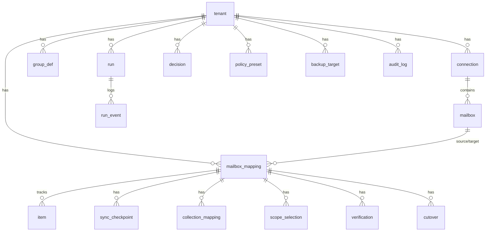

# packages/ledger

The **ledger** is the table of record for the migration core: idempotency mapping, sync checkpoints, drift decisions, runs, verification, cutover, and the optional extra-backup config. The **same schema and the same dialect** are used in both editions — **Postgres everywhere** (managed: Postgres + RLS; self-host: a small bundled Postgres container, or **embedded PGlite** — Postgres-as-WASM in-process, same SQL and same policies, ADR-0028). Rationale: ADR-0005, ADR-0016, **ADR-0023** (supersedes ADR-0010's SQLite option), ADR-0028.

**Migrations** (`migrations/`, plain SQL, applied on startup under an advisory lock):

- `0001_baseline.sql` — the squashed baseline (generated — see `scripts/squash-migrations.sh`): full schema, RLS policies, the non-owner `app_user` role, FORCE on 22 of its 24 RLS tables.
- `0002_force_row_security_stragglers.sql` — FORCEs the two tables the squash preserved as ENABLE-only (`migration_discovery`, `migration_status`).
- `0003_verification_fits_the_contract.sql` — widens the status CHECK to five states; adds `verification_run` (the managed verify start+poll pair's state).
- `0004_managed_apply.sql` — `allow_apply_deletions` DEFAULT FALSE on `mailbox_mapping`; `apply_receipt` with self-consistency CHECKs (the managed apply lifecycle).

> **No SQLite.** ADR-0023 made both editions Postgres-only; `schema-sqlite.ts` / `sqlite-ledger.ts` were deleted from the tree (commit `6d9ecd4`) and all migrations are Postgres-only. Do not reintroduce a second dialect.

## Entities (overview)

## How it backs the architecture
- **Idempotency (§10).** `item` holds one row per source item, keyed by a stable `natural_key` (Message-ID / iCal UID(+RECURRENCE-ID) / vCard UID / file path). `UNIQUE (tenant_id, mapping_id, natural_key_hash)` is the idempotency anchor; `content_hash` drives create/update/skip. Re-running converges -> no duplicates.
- **Stable identity (§11.1).** `mailbox.external_id` stores the **immutable Graph GUID**, so a rename/address change is an UPDATE, not delete+create.
- **Cheap incremental shadow (§10).** `sync_checkpoint` stores the per-collection delta token (Graph deltaLink / CalDAV sync-token / IMAP UIDVALIDITY+UIDNEXT+HIGHESTMODSEQ / ctag).
- **Sent & special-use (§10.1).** `collection_mapping` records "Sent Items" -> "Sent" (`\Sent`) etc.
- **Shared addresses (§14.1).** `mailbox_mapping.pattern` = `shared_s` (Pattern S, full-tree copy) or `distribution_d`; Pattern D groups live in `group_def` (definition + members, no store).
- **Non-destructive (§11.1).** Source deletions are recorded as `status = deleted_source`/`tombstoned`; they are **never auto-applied** to the target.
- **Decision queue (§11.2).** `decision` is the "actions required" inbox; `policy_preset` sets per-category auto vs ask.
- **Cutover gate (§11/§20).** `verification` feeds the gate; `cutover` tracks state.
- **Optional extra backup — retracted (ADR-0015 update, 2026-08-02).** `backup_target` is reserved schema: the feature was never built, and a second open-migrate instance/mapping to a second target achieves the same result. Nothing reads or writes this table.
- **Runs & audit.** `run`/`run_event` give status/progress (links to the Trigger.dev run via `orchestrator_ref`); `audit_log` records control actions.

## Secrets
No secrets in the ledger. `connection.secret_ref` / `backup_target.secret_ref` point to the vault.

## GDPR erasure
Every tenant-scoped table has `ON DELETE CASCADE` from `tenant`, so deleting a tenant purges all its data (right to erasure).

## Multi-tenancy
- **Managed:** RLS on every tenant-scoped table (all FORCEd), enforced at runtime through the non-owner `app_user` role; every data access runs inside **`withTenant()`** (`src/db.ts`) — BEGIN → `SET LOCAL ROLE` → transaction-local `set_config('app.current_tenant', …)`. Full model: `docs/rls-guide.md`.
- **Self-host:** single tenant, same schema and same RLS policies, same `withTenant` path (the driver's `role` arms the role drop — without it, RLS does nothing for an owner/superuser connection).

## The driver seam (`src/driver.ts`)
`LedgerDriver` abstracts where connections come from: **`pgDriver(pool)`** (a `pg.Pool`) or **`pglite-driver.ts`** (one in-process PGlite connection). The seam exists for correctness, not tidiness: PGlite has exactly one connection, so `acquire()` is allowed to WAIT and a single-connection driver serialises concurrent `withTenant` calls instead of nesting transactions across tenants. `LedgerDriver.role` is the RLS switch described above. `runMigrations` (`src/migrate.ts`) goes through the same seam — PGlite is a directory, not a connection string.

## Access layer & migrations
SQL is the source of truth here. The TS access layer is **Drizzle ORM** (`schema-pg.ts`), with plain SQL migrations in `migrations/` applied on startup behind a Postgres advisory lock (`src/migrate.ts`, ADR-0017). The app refuses to start if the schema is newer than it supports.
